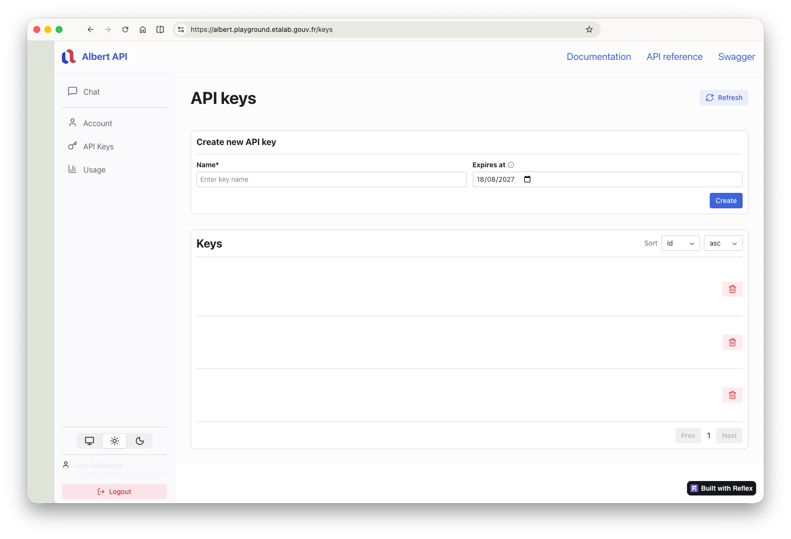

# Clefs API

Albert API utilise un système de clef pour authentifier vos requêtes. Ces clefs sont des **Bearer** tokens, une chaine de caractères alphanumérique unique et secrète commencant par `sk-`. **Ces clefs d'API doivent être stockées en lieu sécurisé et ne doivent jamais être divulguées.**

### Création d'une clef

Vous pouvez créer des clefs d'API de 2 manières, par API ou sur le Playground.



Connectez-vous sur le [playground](https://albert.playground.etalab.gouv.fr/), rendez-vous dans la page _API Keys_ et cliquez sur le bouton _Create key_.

<figure><figcaption></figcaption></figure>

**Attention, la clef est affichée intégralement une seule fois à la création.** Vous devez la copier dans un endroit sécurisé.



Vous pouvez créer une clef d'API en appelant le endpout POST `/v1/keys`. **Attention, vous devez disposer d'une clef API existante pour créer une nouvelle clef.** Cette méthode de création est utilisée pour renouveler des clefs de manière automatique. Si vous ne disposez pas d'une clef API existante, vous pouvez en créer une sur le Playground.

Remplacez `$ALBERT_API_KEY` par une clef non expirée dans la commande ci-dessous.

```
curl -X POST "https://albert.api.etalab.gouv.fr/v1/keys" \
  -H "Authorization: Bearer $ALBERT_API_KEY" \
  -H "Content-Type: application/json" \
  -d '{"name": "my-new-key", "expires": null}'
```

Pour en savoir plus sur les endpoints `/v1/keys`, consultez l'API Reference [ici](https://guides.ia.numerique.gouv.fr/albert-api/api-reference/liste-des-endpoint/keys).



### Expiration des clefs

**Toutes les clefs API ont une date d'expiration de maximum 1 an à compter de la date de création.** Vous pouvez configurer une clef avec une date d'expiration inférieure à 1 an lors de la création. Il est en revanche impossible d'obtenir une clef sans expiration pour des raisons de sécurité.

**Exemple de requête :**

### Consulter ses clefs



Vous pouvez consulter vos clefs sur la page _API Keys_ du [Playground](https://albert.playground.etalab.gouv.fr/).



Vous pouvez consulter vos clefs en appelant le endpoint GET `/v1/keys`.

Remplacez `$ALBERT_API_KEY` par une clef non expirée dans la commande ci-dessous.

```
curl -X GET "https://albert.api.etalab.gouv.fr/v1/keys" \
  -H "Authorization: Bearer $ALBERT_API_KEY"
```

Vous pouvez également récupérer le détail d'une clef en appelant le endpoint GET `/v1/keys/{key}`.

```
curl -X GET "https://albert.api.etalab.gouv.fr/v1/keys/{key}" \
  -H "Authorization: Bearer $ALBERT_API_KEY"
```

Remplacez `{key}` par l'identifiant de la clef que vous souhaitez récupérer.

Pour en savoir plus sur les endpoints `/v1/keys`, consultez l'API Reference [ici](https://guides.ia.numerique.gouv.fr/albert-api/api-reference/liste-des-endpoint/keys).



## Révoquer une clef



Vous pouvez révoquer une clef sur la page _API Keys_ du [Playground](https://albert.playground.etalab.gouv.fr/) en cliquant sur le bouton _Delete_ de la clef que vous souhaitez révoquer.<br>

<figure><figcaption></figcaption></figure>

**Attention, cette action est irréversible.** Une fois une clef révoquée, elle ne peut plus être utilisée.



Vous pouvez révoquer une clef en appelant le endpoint DELETE `/v1/keys/{key}`.

```
curl -X DELETE "https://albert.api.etalab.gouv.fr/v1/keys/{key}" \
  -H "Authorization: Bearer $ALBERT_API_KEY"
```

Remplacez `{key}` par l'identifiant de la clef que vous souhaitez révoquer et `$ALBERT_API_KEY` par une clef non expirée dans la commande ci-dessous.

**Attention, cette action est irréversible.** Une fois une clef révoquée, elle ne peut plus être utilisée.

Pour en savoir plus sur les endpoints `/v1/keys`, consultez l'API Reference [ici](https://guides.ia.numerique.gouv.fr/albert-api/api-reference/liste-des-endpoint/keys).



### Limites de consommation

Toutes vos clefs d'API partagent les mêmes limites de consommation. En effet, ces limites sont appliquées au niveau de votre utilisateur. Pour en savoir plus sur les limites de consommation, consultez la section [Quotas & limites](quotas.md).
