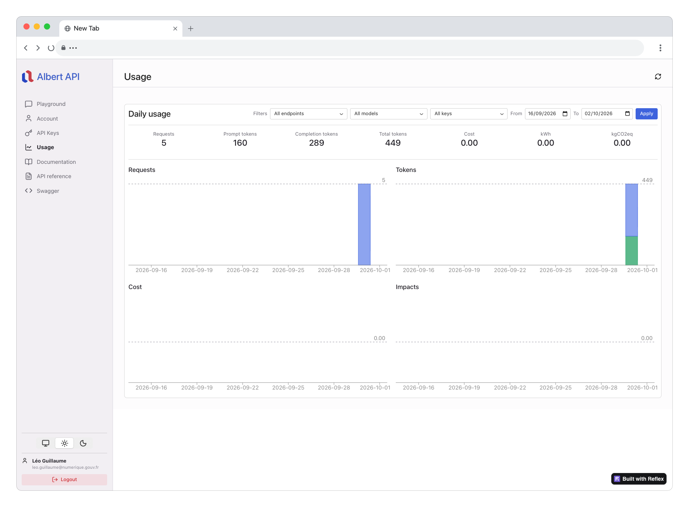

# Quotas et limites

Chaque compte dispose de limites de consommation. Ces limites sont configurées par la DINUM. Elles sont de 2 types : limites par token et limites par requête. 

Les limites comptabilisés uniquement sur les endpoints qui appellent des modèles : `/v1/audio/transcriptions`, `/v1/chat/completions`, `/v1/embeddings`, `/v1/ocr`et `/v1/rerank`. 

Vous pouvez consulter les limites par token et par requête pour chaque modèle sur la documentation des modèles disponibles [ici](../modeles/available-models.md). **Les limites sont définis selon des niveaux d’accès : expérimentation, production limitée ou partenaire.**

## Niveaux d'accès (tiers)

### Expérimentation

L’accès à Albert API est ouvert à tous les agents de la fonction publique d'État des fins d'expérimentation.
Ces expérimentations sont toutefois soumises à certaines limitations d’usage :

* Accès aux modèles principaux d’Albert API
* Quotas d'utilisation bas, pouvant être augmenté selon le besoin (voir détails ci-dessous)
* Pas de garantie de disponibilité
* Accès restreint en période de forte demande

### Production limitée

Si vos quotas d'expérimentation s'avèrent insuffisants et que vous souhaitez utiliser Albert API avec des volumes plus importants, deux étapes sont nécessaires :

* Remplir le formulaire suivant : [Formulaire production limitée](https://grist.numerique.gouv.fr/o/albert/forms/dteMmqusoagbJ68woTRTZF/11)
* Nous contacter à l'adresse : albert.api@numerique.gouv.fr
* Nous appliquerons ensuite les quotas de « Production limitée » sur le compte indiqué

### Partenaire

En décembre 2025, la DINUM a publié à destination des autres ministères une note visant au cofinancement des infrastructures d'Albert API.

Les agents des ministères partenaires bénéficient de conditions d'utilisation d'Albert API pour la production :

* Accès à l'intégralité des modèles d'Albert API
* Garantie de disponibilité (SLA)
* Accompagnement personnalisé
* Quotas d'utilisation élevé, pouvant être augmenté selon le besoin (voir détails ci-dessous)


Pourquoi un cofinancement ?
* Les coûts d’hébergement, de calcul (GPU, licences LLM) et de maintenance sont directement liés au nombre d’utilisateurs.
* La mutualisation permet une meilleure efficience de la dépense publique et évite aux ministères d’investir individuellement dans des infrastructures coûteuses et complexes.
* Albert API est une solution clé en main, sécurisée permettant aux ministères de se concentrer sur leurs missions métiers.


## Limites par token

Dans Albert API, les limites par tokens sont exprimées en **tokens par minute (TPM) et par jour (TPD)**.


Si vous vous demandez ce qu'est un token ou comment le texte est découpé en tokens, consultez notre FAQ *[Qu'est ce qu'un token ?](../ressources/faq.md#quest-ce-quun-token)*.


### Comment sont comptabilisés les tokens ?

Les tokens sont comptabilisés sur les endpoints qui appellent des modèles : `/v1/audio/transcriptions`, `/v1/chat/completions`, `/v1/embeddings`, `/v1/ocr`et `/v1/rerank`. Ils sont comptabilisés différement selon les endpoints.

Vous retrouvez un champ `usage` en réponse de chacun de ces endpoints vous indiquants le nombre de tokens consommés par la requête.
De plus, l'en-tête de la réponse vous donne  




**Les tokens sont comptabilisés sur tous les messages de la requête ainsi que sur tous les tokens générés par le modèle (content, reasoning, tool calls, etc.)**.

* `prompt_tokens` : tokens de tous les messages de la requête (content, reasoning, etc.)
* `completion_tokens` : tokens générés par le modèle (content, reasoning, tool calls, etc.)

Voici un exemple de requête avec sa réponse:

```json
{
    "model": "openweight-large",
    "messages": [
        {
            "role": "system",
            "content": "Tu es un assistant de chat qui répond à des questions." → 12 tokens
        },
        {
            "role": "user",
            "content": "Bonjour, comment allez-vous ?" → 6 tokens
        },
        {
            "role": "assistant",
            "content": "Je vais bien, merci pour votre question." → 9 tokens
        },
        {
            "role": "user",
            "content": "Quel est votre nom ?" → 5 tokens
        }
    ]
}
```

**Réponse**
```json
{
    "id": "chatcmpl-1234567890",
    "object": "chat.completion",
    "created": 1717000000,
    "model": "openweight-large",
    "choices": [
        {
            "index": 0,
            "message": {
                "role": "assistant",
                "content": "Je m'appelle Albert." → 5 token
            },
            "finish_reason": "stop"
        }
    ],
   "usage": {
        "prompt_tokens": 32,
        "completion_tokens": 5,
        "total_tokens": 37,
        "prompt_tokens_details": {
            "cached_tokens": 0
            },
        "cost": 0,
        "impacts": {
            "kWh": 0,
            "kgCO2eq": 0
        }
    }
  }
```





Les tokens sont comptabilisés **uniquement sur les inputs** de la requête.

* `prompt_tokens` : tokens des textes passés dans `input` (ou dans `messages`)
* `completion_tokens` : toujours 0

Voici un exemple de requête :
```json
{
    "model": "openweight-embeddings-large",
    "input": [
        "Albert API est un outil de IA open source.", → 10 tokens
        "Il est développé par la communauté de l'IA open source." → 13 tokens
    ]
}
```




Les tokens sont comptabilisés **uniquement sur le query et les documents** de la requête.

* `prompt_tokens` : tokens de `query` + tokens de chaque document
* `completion_tokens` : toujours 0

Voici un exemple de requête :
```json
{
    "model": "openweight-rerank-large",
    "query": "Albert API est un outil de IA open source.", → 10 tokens
    "documents": [
        "Albert API est un outil de IA open source.", → 10 tokens
        "Il est développé par la communauté de l'IA open source." → 13 tokens
    ]
}
```




Les tokens sont comptabilisés sur le **`prompt` optionnel** (si fourni) et sur le **texte transcrit** renvoyé par le modèle. Le fichier audio lui-même n'est **pas** tokenisé.

* `prompt_tokens` : tokens du champ `prompt` (0 si le prompt est vide ou omis)
* `completion_tokens` : tokens du texte de la transcription

Voici un exemple de requête avec sa réponse :

```json
{
    "model": "whisper-large-v3",
    "file": "enregistrement.mp3",
    "language": "fr",
    "prompt": "Réunion d'équipe, vocabulaire technique." → 8 tokens
}
```

**Réponse** (`response_format=json`)
```json
{
    "id": "audio-1234567890",
    "model": "whisper-large-v3",
    "text": "Bonjour à tous, passons au point suivant de l'ordre du jour." → 14 tokens,
    "usage": {
        "prompt_tokens": 8,
        "completion_tokens": 14,
        "total_tokens": 22,
        "prompt_tokens_details": {
            "cached_tokens": 0
        },
        "cost": 0,
        "impacts": {
            "kWh": 0,
            "kgCO2eq": 0
        }
    }
}
```





Les tokens sont comptabilisés sur le **`document_annotation_prompt` optionnel** (si fourni) et sur le **texte extrait** (markdown des pages + annotation document éventuelle). Le document ou l'image en entrée n'est **pas** tokenisé.

* `prompt_tokens` : tokens du champ `document_annotation_prompt` (0 si omis)
* `completion_tokens` : tokens du markdown de chaque page, plus ceux de `document_annotation` le cas échéant

Voici un exemple de requête avec sa réponse :

```json
{
    "model": "mistral-ocr-2512",
    "document": {
        "type": "document_url",
        "document_url": "https://example.com/facture.pdf"
    },
    "document_annotation_prompt": "Extrais le numéro de facture." → 6 tokens
}
```

**Réponse**
```json
{
    "id": "ocr-1234567890",
    "model": "mistral-ocr-2512",
    "pages": [
        {
            "index": 0,
            "markdown": "# Facture\nNuméro : FAC-2024-42\nMontant : 120 €" → 18 tokens,
            "images": []
        }
    ],
    "document_annotation": "{\"invoice_number\": \"FAC-2024-42\"}" → 8 tokens,
    "usage": {
        "prompt_tokens": 6,
        "completion_tokens": 26,
        "total_tokens": 32,
        "prompt_tokens_details": {
            "cached_tokens": 0
        },
        "cost": 0,
        "impacts": {
            "kWh": 0,
            "kgCO2eq": 0
        }
    }
}
```




## Limites par requête

Dans Albert API, les limites par requêtes sont exprimées en **requêtes par minute (RPM) et par jour (RPD)**. 
Les requêtes sont comptabilisées uniquement sur les endpoints qui appellent un modèle.

## Comment suivre sa consommation ?

### Voir ses limites

Deux sources pour connaître les plafonds appliqués à votre compte :

* l’endpoint [GET /v1/me/info](https://guides.ia.numerique.gouv.fr/albert-api/api-reference/liste-des-endpoint/me#get-v1-me-info) — limites associées à votre compte ;
* la page [Modèles disponibles](../modeles/available-models.md) — limites TPM, TPD, RPM et RPD par modèle et par niveau d’accès.

### Suivre sa consommation en temps réel

À chaque appel vers un modèle, les en-têtes de réponse indiquent l’état de vos quotas (tokens et requêtes) :

```
x-ratelimit-limit-request: 10
x-ratelimit-limit-token: 100
x-ratelimit-remaining-request: 9
x-ratelimit-remaining-token: 0
x-ratelimit-reset-requests: 49s
x-ratelimit-reset-token: 0s
```

Le corps de la réponse contient aussi un champ `usage` avec le détail des tokens consommés par la requête :

```json
"usage": {
    "prompt_tokens": int,
    "completion_tokens": int,
    "total_tokens": int,
    "prompt_tokens_details": {
        "cached_tokens": int
    },
    "cost": int,
    "impacts": {
        "kWh": float,
        "kgCO2eq": float
    }
}
```

### Consulter l’historique de consommation

Deux moyens de consulter votre consommation cumulée :



Connectez-vous sur le [Playground Albert API](https://albert.playground.etalab.gouv.fr) et ouvrez la page **Usage**.

<figure><figcaption>Page Usage du Playground</figcaption></figure>



Appelez l’endpoint [GET /v1/me/usage](https://guides.ia.numerique.gouv.fr/albert-api/api-reference/liste-des-endpoint/me#get-v1-me-usage) :

```bash
curl -X GET "https://albert.api.etalab.gouv.fr/v1/me/usage" \
  -H "Authorization: Bearer $API_KEY"
```

Pour le détail des paramètres et du format de réponse : [Usage & facturation](usage.md).



### Dépassement de limites

Lorsque le trafic ou les tokens dépassent les plafonds configurés pour votre compte, l’API peut répondre **429 Too Many Requests**. Stratégie recommandée : **backoff exponentiel**, respect éventuel d’un en-tête **`Retry-After`**, et réduction du parallélisme.