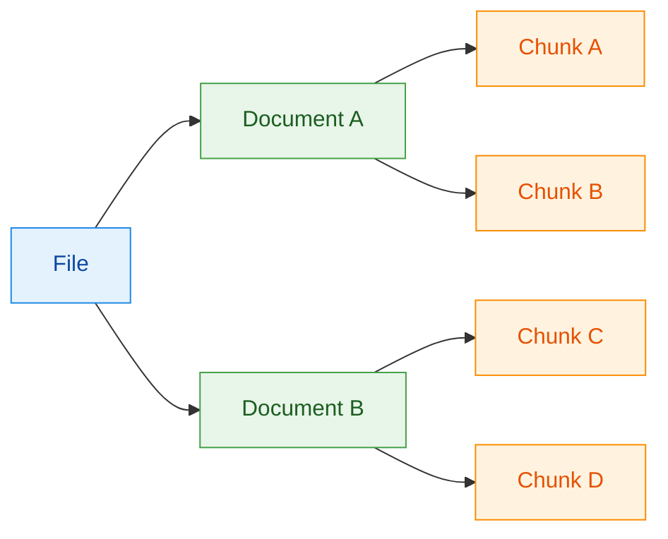
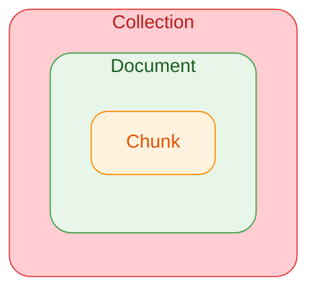

# RAG - Génération Augmentée par Récupération

## Qu'est ce que le RAG ?

Le RAG est une technique permettant de limitée les hallucinations du modèle en lui fournissant un contexte plus riche. Il consiste en 3 étapes : 

1. Recherche des extraits de textes pertinents par rapport une question
2. Construction d'un prompt avec le contexte trouvé
3. Envoi du prompt comprennant les textes pertinents et la question à un LLM pour obtenir une réponse

## Le RAG avec Albert API

Albert API propose d'interagir avec une base de données vectorielle (*vector store*) pour permettre de réaliser du RAG. L'API propose de nourrir ce vector store en important des fichiers qui seront automatiquement traités et insérés dans le *vector store*.


**Qu'est-ce qu'un vector store ?**
Un vector store est une base de données qui permet de stocker des documents textes et leur représentation vectorielle (suite de nombres qui représentent les concepts présents dans le document). Pour plus d'informations, rendez-vous sur la section [...] 


Les collections sont des espaces de stockage dans ce *vector store*. Elles sont utilisées pour organiser les fichiers qui sont importés par l'API. Ces fichiers sont convertis en documents, contenant le texte extrait. Ces documents sont alors découpés en chunks et convertis en vecteurs à l'aide d'un modèle d'embeddings. Ces vecteurs ainsi que le texte qui a été vectorisé sont enregistrés dans la base de données vectorielle.

L'intégration se déroule donc en 3 phases :
- **File** : fichier original (non stocké)
- **Document** : texte extrait d'un fichier
- **Chunk** : portion de texte découpée dans un document


Qu'est ce qu'un chunk et pourquoi les documents sont découpés en chunks ?

Un chunk est portion de texte découpée dans un document. Nous sommes contraints de découpé le texte car les LLM ont 2 limitations:
- leur fenêtre de contexte est limitée (par exemple 132 000 tokens). 
- leur capacité de traitement de long prompt est limitée. Il arerive souvent qu'un prompt soit trop long, le LLM ait des difficultés à le comprendre ou à retrouver une information noyée dans le texte.

En conséquence, il est opportun de ne pas envoyer tous les documents en entier au LLM mais de ne lui envoyer que les parties des documents (chunks) qui sont pertinentes pour la question.




Une fois importés, vous pouvez interroger l'API pour récupérer les documents ou chunks qui vous intéressent en suivant la hiérarchie suivante reposant sur les 3 entités :
- **Collection** : espace de stockage des documents et chunks
- **Document** : portion de texte découpée dans un fichier
- **Chunk** : portion de texte découpée dans un document



**Il existe deux types de collections : publiques et privées.** Les collections publiques sont accessibles à tous alors que les collections privées sont accessibles uniquement à vous.


Les collections publiques sont créées et mise à jour régulièrement par l'équipe d'Albert API. Vous n'avez pas la possibilité de créer ou de mettre à jour une collection publique.

| Nom de la collection | ID | Contenu |
| --- | --- | --- |
| `mediatech-legifrance` | 139226 | Législation et réglementation nationale consolidée : codes officiels (73 en vigueur), lois, décrets, ordonnances depuis 1945, arrêtés sélectionnés depuis 1990. Source : legifrance.gouv.fr |
| `mediatech-fiches-travail-emploi` | 150277 | Fiches pédagogiques du Ministère du travail sur le droit du travail. Source : travail-emploi.gouv.fr |
| `mediatech-fiches-service-public` | 150281 | Fiches pratiques à destination des usagers (droits, démarches administratives, formulaires). Source : service-public.gouv.fr |
| `mediatech-annuaire-services-publics-locaux` | 139997 | Annuaire de plus de 86 000 guichets publics locaux (mairies, organismes sociaux, services de l'État) avec coordonnées et horaires. Source : data.gouv.fr |
| `mediatech-annuaire-services-publics-nationaux` | 139998 | Référentiel de l'organisation administrative de l'État : ~6 000 organismes, missions, hiérarchie, coordonnées et responsables. Source : data.gouv.fr |
| `mediatech-dossiers-legislatifs` | 139999 | Dossiers législatifs : lois depuis juin 2002, ordonnances depuis 2002, projets et propositions de loi en préparation. Source : data.gouv.fr |
| `mediatech-decisions-conseil-constitutionnel` | 140006 | Décisions du Conseil constitutionnel depuis 1958 (DC, QPC, contentieux électoral, etc.). Source : data.gouv.fr |
| `mediatech-decisions-cnil` | 140029 |Délibérations de la CNIL depuis 1979. Source : echanges.dila.gouv.fr |



## Etape 1. Recherche des extraits de textes pertinents par rapport une question

### Créer une collection privée

Pour créer une collection privée, vous pouvez utiliser l'endpoint `/v1/collections` en spécifiant un nom.

**Exemple de requête :**


```bash
curl -sS "https://albert.api.etalab.gouv.fr/v1/collections" \
  -H "Authorization: Bearer $ALBERT_API_KEY" \
  -H "Content-Type: application/json" \
  -d '{"name": "ma-collection"}'
```



```python
import os
import requests

collection = requests.post(
    url="https://albert.api.etalab.gouv.fr/v1/collections",
    headers={"Authorization": f"Bearer {os.environ['ALBERT_API_KEY']}"},
    json={"name": "ma-collection"},
)

collection_id = collection.json()["id"]
```



```javascript
const baseUrl = "https://albert.api.etalab.gouv.fr/v1";
const apiKey = process.env.ALBERT_API_KEY;

const res = await fetch(`${baseUrl}/collections`, {
  method: "POST",
  headers: {
    Authorization: `Bearer ${apiKey}`,
    "Content-Type": "application/json",
  },
  body: JSON.stringify({ name: "ma-collection" }),
});

if (!res.ok) {
  throw new Error(`HTTP ${res.status}: ${await res.text()}`);
}

const collection = await res.json();
const collectionId = collection.id;
```



### Consulter les collections

Quelles soient publiques ou privées, vous pouvez consulter les collections en utilisant l'endpoint `/v1/collections`.


Si vous ne voyez pas la collection que vous avez créée, il est possible que ce soit l'effet de la pagination. Changez les paramètres `offset` et `limit` pour parcourir les collections.

De même, vous pouvez filtrer par type de collection en spécifiant le paramètre `visibility` à `private` ou `public`.


**Exemple de requête :**


```bash
curl -sS "https://albert.api.etalab.gouv.fr/v1/collections?offset=0&limit=10" \
  -H "Authorization: Bearer $ALBERT_API_KEY" \
  -H "Content-Type: application/json" \
```





```python
import requests
import os

collections = requests.get(
    url="https://albert.api.etalab.gouv.fr/v1/collections",
    params={"offset": 0, "limit": 10},
    headers={"Authorization": f"Bearer {os.environ['ALBERT_API_KEY']}"},
)
collections.raise_for_status()
collections = collections.json()
```






```javascript
const baseUrl = "https://albert.api.etalab.gouv.fr/v1";
const apiKey = process.env.ALBERT_API_KEY;

const res = await fetch(`${baseUrl}/collections`, {
    method: "GET",
    headers: {
        Authorization: `Bearer ${apiKey}`,
        "Content-Type": "application/json",
    },
    params: { offset: 0, limit: 10 },
});

if (!res.ok) {
    throw new Error(`HTTP ${res.status}: ${await res.text()}`);
}

const collections = await res.json();
```



### Créer un document à partir d'un fichier

Un fois avor créé une collection, récupérez son ID et utilisez-le pour créer un document. L'ID est retourné lors de la création de la collection ou lors de la consultation des collections.

Pour uploader un fichier, vous pouvez utiliser l'endpoint `/v1/documents` en spécifiant le fichier à uploader et le ID de la collection. L'endpoint accepte les fichiers de type `PDF`, `TXT`, `HTML` et `MARKDOWN` jusqu'à 20 Mb par fichier.

Lors de cet appel, l'API va :
- extraire le texte du fichier
- découper le texte en chunks
- vectoriser les chunks (appel au modèle d'embeddings)
- stocker les chunks et leur représentation vectorielle dans la base de données vectorielle


Le endpoint POST `/v1/documents` propose de nombreux paramètres pour configurer le traitement du document (chunking, metadata, etc.). Pour plus d'informations, consultez la page [API reference - Documents](https://guides.ia.numerique.gouv.fr/albert-api/api-reference/liste-des-endpoint/documents#post-v1-documents).


**Exemple de requête :**



```bash
curl -sS "https://albert.api.etalab.gouv.fr/v1/documents" \
  -H "Authorization: Bearer $ALBERT_API_KEY" \
  -H "Content-Type: application/pdf" \
  -F "file=@ma-collection.pdf" \
  -F "collection_id=1234567890"
```





```python
import requests
import os

document = requests.post(
    url="https://albert.api.etalab.gouv.fr/v1/documents",
    headers={"Authorization": f"Bearer {os.environ['ALBERT_API_KEY']}"},
    files={"file": ("ma-collection.pdf", open("ma-collection.pdf", "rb"), "application/pdf")},
    data={"collection_id": "1234567890"},
)
document.raise_for_status()
document_id = document.json()["id"]
```





```javascript
const baseUrl = "https://albert.api.etalab.gouv.fr/v1";
const apiKey = process.env.ALBERT_API_KEY;

const document = await fetch(`${baseUrl}/documents`, {
    method: "POST",
    headers: {

const document = await res.json();
const documentId = document.id;
```



### Rechercher des chunks à partir d'une question

Pour rechercher des chunks à partir d'une question, vous pouvez utiliser l'endpoint `/v1/search`. Il est possible de modifier [la méthode de recherche](#les-différentes-méthodes-de-recherche) ou [les filtres de recherche](#les-filtres-de-recherche).

**Exemple de requête :**



```bash
curl -sS "https://albert.api.etalab.gouv.fr/v1/search" \
  -H "Authorization: Bearer $ALBERT_API_KEY" \
  -H "Content-Type: application/json" \
  -d '{"query": "Quel est le sujet du document ?"}'
```





```python
import requests
import os

search = requests.post(
    url="https://albert.api.etalab.gouv.fr/v1/search",
    headers={"Authorization": f"Bearer {os.environ['ALBERT_API_KEY']}"},
    json={"query": "Quel est le sujet du document ?"},
)
search.raise_for_status()
search_results = search.json()
```





```javascript
const baseUrl = "https://albert.api.etalab.gouv.fr/v1";
const apiKey = process.env.ALBERT_API_KEY;

const search = await fetch(`${baseUrl}/search`, {
    method: "POST",
    headers: {
        Authorization: `Bearer ${apiKey}`,
        "Content-Type": "application/json",
    },
    body: JSON.stringify({ query: "Quel est le sujet du document ?" }),
});

if (!search.ok) {
    throw new Error(`HTTP ${search.status}: ${await search.text()}`);
}

const searchResults = await search.json();
```



Il est aussi possible de dissocier la recherche du chat. Cela permet plus de contrôle sur les chunks sélectionnés (filtrage, scoring, [rerank](https://doc.incubateur.net/alliance/albert-api/guides/reranking), etc.).

1. **Recherche** — `POST /v1/search` avec `query`, `collection_ids`, `method`, `limit`, etc.
2. **Prompt** — concaténation des `chunk.content` renvoyés pour construire le contexte.
3. **Chat** — `POST /v1/chat/completions` avec le prompt enrichi.

```python
import os
import requests
from openai import OpenAI

base_url = "https://albert.api.etalab.gouv.fr/v1"
api_key = os.environ["ALBERT_API_KEY"]
headers = {"Authorization": f"Bearer {api_key}"}
client = OpenAI(base_url=base_url, api_key=api_key)
```

#### Les différentes méthodes de recherche

Le endpoint POST `/v1/search` propose 3 méthodes de recherche configurable avec le paramètre `method`:
* `semantic` (défaut) : recherche sémantique basée sur la similarité des vecteurs
* `exact` : recherche exacte basée sur l'exactitude du texte
* `hybrid` : la recherche hybride combine la similarité des vecteurs et la recherche exacte. Elle va classer les résultats des deux recherches par pertinence.

#### Les filtres de recherche

Le endpoint POST `/v1/search` propose des filtres de recherche configurable avec le paramètre `filters`. Par défaut, aucun filtre n'est appliqué et la recherche est effectuée sur toutes les collections et tous les documents.

| Nom du filtre | Description |
| --- | --- |
| `collection_ids` | Filtre les résultats par collection |
| `document_ids` | Filtre les résultats par document |
| `metadata_filters` | Filtre les résultats par metadata |

## Etape 2. Construire un prompt avec le contexte trouvé

Une fois les chunks trouvés avec le endpoint POST `/v1/search`, vous pouvez construire un prompt avec le contexte trouvé.

**Exemple de template de prompt :**

```text
Réponds uniquement en t'appuyant sur les extraits fournis.

[Question]

{ question }

[Extraits]

{ extrait_1 }
{ extrait_2 }
... 
```

## Etape 3. Envoyer le prompt au LLM (`/v1/chat/completions`)

A partir du prompt construit à l'étape précédente, vous pouvez envoyer le prompt au LLM en utilisant l'endpoint POST `/v1/chat/completions`.

**Exemple de requête :**



```bash
curl -sS "https://albert.api.etalab.gouv.fr/v1/chat/completions" \
  -H "Authorization: Bearer $ALBERT_API_KEY" \
  -H "Content-Type: application/json" \
  -d '{"prompt": "Quel est le sujet du document ?", "model": "gpt-4o-mini"}'
```





```python
import os
import requests
from openai import OpenAI

base_url = "https://albert.api.etalab.gouv.fr/v1"
api_key = os.environ["ALBERT_API_KEY"]
headers = {"Authorization": f"Bearer {api_key}"}
client = OpenAI(base_url=base_url, api_key=api_key)
```





```javascript
const baseUrl = "https://albert.api.etalab.gouv.fr/v1";
const apiKey = process.env.ALBERT_API_KEY;
```





```python
import os
import requests
from openai import OpenAI

base_url = "https://albert.api.etalab.gouv.fr/v1"
api_key = os.environ["ALBERT_API_KEY"]
headers = {"Authorization": f"Bearer {api_key}"}
client = OpenAI(base_url=base_url, api_key=api_key)
```





```javascript
const baseUrl = "https://albert.api.etalab.gouv.fr/v1";
const apiKey = process.env.ALBERT_API_KEY;
```
