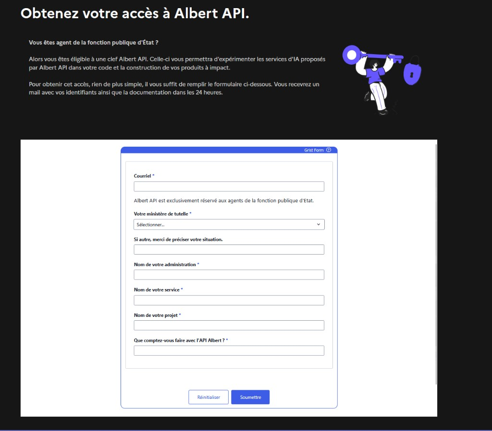
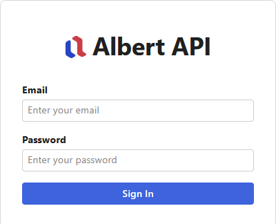
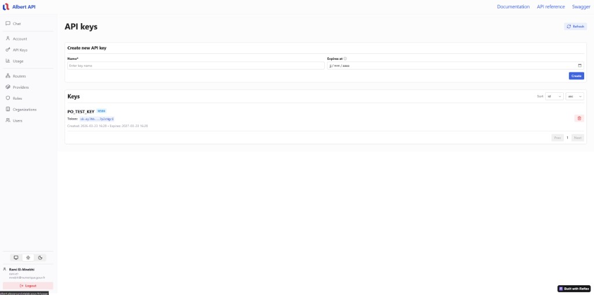
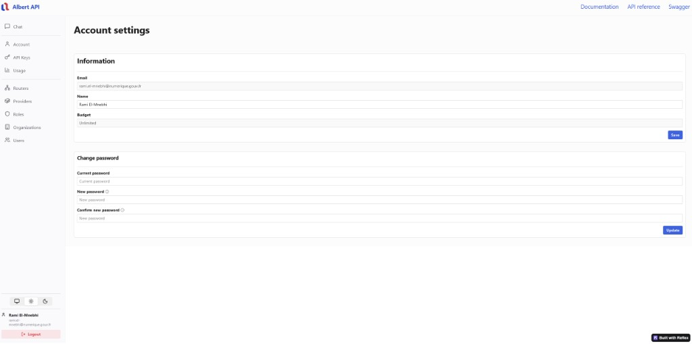

# Création de compte & accès Albert API (workflow)

Cette page décrit le parcours complet pour obtenir un compte Albert API puis commencer à utiliser le service.


Ce workflow correspond au déroulé typique décrit côté plateforme : demande d’accès, validation admin, email de confirmation, connexion au **Playground**, puis création des clés API.


## 1) Demander un accès (formulaire)

Renseignez le formulaire de demande d’accès :

[Demander un accès](https://albert.sites.beta.gouv.fr/access/)

Capture du formulaire :

## 2) Validation admin (contrôle du domaine email)

Un administrateur **Albert API** valide la demande en vérifiant notamment :

* que l’adresse email appartient à un domaine correspondant à une administration française (contrôle de format/extension) ;
* et que le compte ne relève pas de catégories “fonction territoriale” ou “hospitalière” (hors périmètre ici).


Le détail exact des règles de validation peut évoluer. Si votre demande est refusée, contactez l’équipe via le canal support défini par votre organisation.


## 3) Email de confirmation (modèle de message)

Une fois l’accès validé, vous recevez un email qui contient notamment :

* vos identifiants pour vous connecter au **Playground** : ID + mot de passe ;
* un lien vers le canal **Tchap** “Albert API - Support & retours utilisateurs” ;
* une invitation à créer vos **clés API** dans le Playground ;
* un rappel : **changer votre mot de passe dès la première connexion**.

Lien (canal Tchap) indiqué dans le modèle d’email :

[Ouvrir “Albert API - Support & retours utilisateurs” sur Tchap](https://www.tchap.gouv.fr/#/room/!gpLYRJyIwdkcHBGYeC:agent.dinum.tchap.gouv.fr)

Lien vers le Playground :

[Ouvrir le Playground](https://albert.playground.etalab.gouv.fr/)

## 4) Liens utiles dans Tchap

Après connexion à Tchap, vous retrouvez aussi des liens “guidés” (statut, documentation, Playground, etc.) dans le canal associé.

Exemples de liens :

* [Statuts de l’API (quand publiés)](https://albert.status.etalab.gouv.fr)
* [Formulaire de demande d’accès](https://albert.sites.beta.gouv.fr/access/)
* [Support / prise de rendez-vous](https://albertapi.youcanbookme.com/)
* [Documentation endpoints](https://albert.api.etalab.gouv.fr/documentation)
* [Swagger](https://albert.api.etalab.gouv.fr/swagger)
* [Playground](https://albert.playground.etalab.gouv.fr/)
* [Tutoriels](https://docs.opengatellm.org/docs/guides/chat_completions)
* [Boîte à idées](https://ideabox.albert.etalab.gouv.fr/)
* Statistiques d’usage : (tableau de bord Metabase côté instance)

## 5) Se connecter au Playground

Connectez-vous au Playground avec l’ID et le mot de passe reçus par email.

Capture de la page de connexion :

## 6) Créer vos clés API

Dans le Playground, ouvrez la section **API keys** pour créer une première clé.

Capture de la page “API keys” :


La clé API sert ensuite dans l’en-tête HTTP :
`Authorization: Bearer <votre_clé>`


### Changer le mot de passe (si demandé)

Après la première connexion, la plateforme invite à changer votre mot de passe.

Capture de la page “Account settings” :

## 7) Premier test rapide

Pour vérifier votre intégration, vous pouvez enchaîner avec :

* le guide [Démarrage rapide](quickstart.md) ;
* et ensuite [Chat completions](../guides/chat-completions.md).

